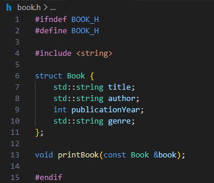

# Библиотека
Создание многофайлового проекта на C++ который позволит управлять библиотекой книг. Проект должен состоять из нескольких файлов:
-	main.cpp - основной файл, в котором находится функция main().
-	book.h - заголовочный файл, содержащий структуру book и объявления функций и переменных для работы с книгами.
-	book.cpp - файл, содержащий реализацию функций для работы с книгами.
-	library.h - заголовочный файл, содержащий структуру library и объявления функций и переменных для работы с библиотекой.
-	library.cpp - файл, содержащий реализацию функций для работы с библиотекой.
-	Writer.h – заголовочный файл, содержащий структуру писатель и все его функции.
-	Writer.cpp – файл реализации всех функций писателя.

## Требования 
В структуре писатель должны находится следующие атрибуты:
-	День рождения в формате “DD:MM:YYYY”
-	ФИО в качестве одной переменной (p.s. это значит, для ФИО необходимо выделить отдельную структуру)
-	Список написанных автором книг. Контейнер для хранения выбирается по вашему усмотрению (vector, map, массив, список…). При сдаче объяснить выбор того или иного контейнера.
-	Возраст писателя.
  
В структуре писатель должны быть реализованы следующие функции:
-	Изменить имя
-	Изменить фамилию
-	“Написать” книгу. А точнее просто создать экземпляр структуры book и добавить его в список написанных автором книг.
  
В библиотеке хранятся книги, каждая из которых имеет следующие атрибуты:
-	Название
-	Автор
-	Год издания
-	Жанр (роман, повесть, стихи и т.д.)
  
В библиотеке можно выполнять следующие действия:
-	Добавить книгу
-	Удалить книгу
-	Найти книгу по названию или автору
-	Вывести список всех книг
  
В файле main.cpp должна быть реализована функция main(), которая позволяет пользователю взаимодействовать с библиотекой.

## Условия
-	Не использовать классы
-	Использовать только функции, переменные и структуры
-	Использовать файлы book.h, book.cpp, library.h, library.cpp, writer.h, writer.cpp и main.cpp
-	Обеспечить корректную работу программы и обработку ошибок

## Реализация
### Заголовочный файл book содержащий структуру и объявление функций

